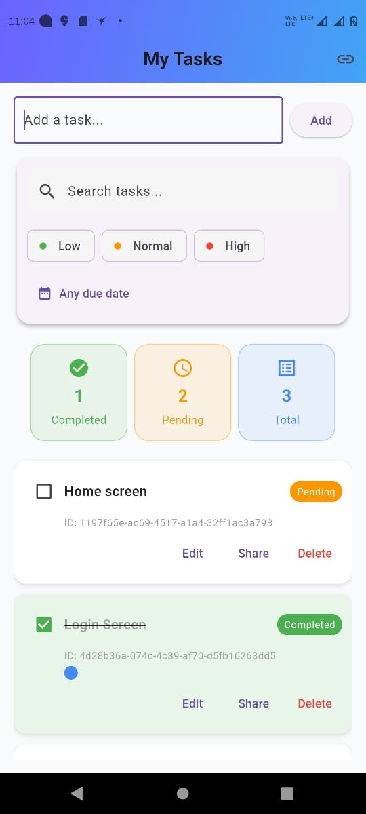
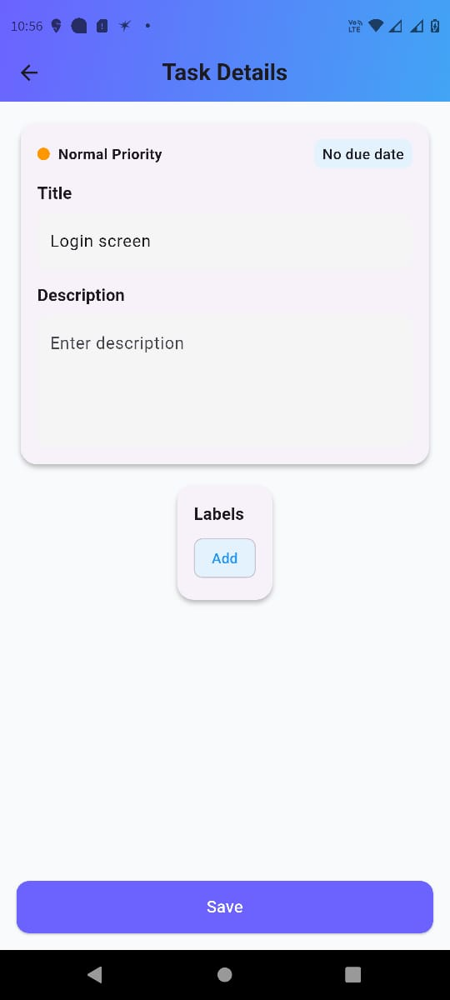

# 🗂️ Flutter Tasks App

A Flutter application to manage, edit, and share tasks efficiently.

## ✨ Features
- **Splash Screen**, **Home Page**, and **Task Detail Page**
- Create, edit, delete, and share tasks
- Task **search functionality**
- View tasks by **status**:
    -  Completed — shows only completed tasks
    -  Pending — shows only pending tasks
    -  Total — shows all tasks
- On the **Task Detail Page**, you can **edit and save** a task
- **Edited tasks** are updated and visible to the **task owner**
- If you **copy a task ID and join**, the **joined task is highlighted** with a **blue indicator**

## 🖼️ Screenshots

### 🚀 Splash Screen


### 🏠 Home Page


### 📝 Task Detail Page


## 🚀 Tech Stack
- **Flutter (Dart)**
- **Riverpod** for state management
- **Firebase** for backend services
- **GitHub** for version control

## 🧩 Setup
1. Clone the repository:
   ```bash
   git clone https://github.com/Praveen1593/todo_app.git
